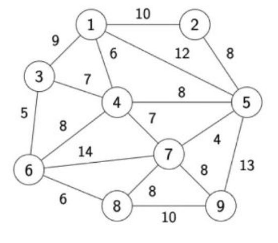
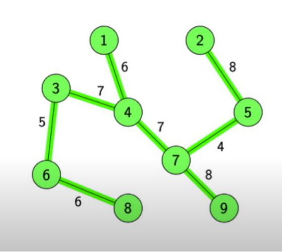
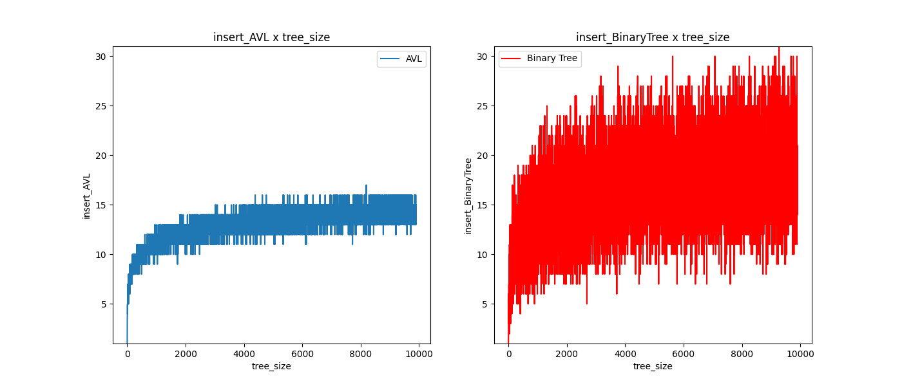

# Projeto de Conclusão de Curso de Estrutura de Dados

## Principais Tópicos

### 1. Construir um Compactador de Arquivos Utilizando a Estrutura Huffman
Neste tópico, o foco é na implementação de um compactador de arquivos baseado na codificação de Huffman. O objetivo é otimizar o armazenamento através da compressão eficiente de arquivos.

 ### 2. Solução Eficiente para o Desafio de Marcinho Utilizando o Algoritmo Kruskal

#### Introdução

Neste tópico, abordaremos a solução proposta para o desafio logístico enfrentado por Marcinho, um empreendedor que construiu um complexo de 9 mansões de luxo em uma região isolada. O desafio envolve o fornecimento eficiente de energia elétrica para todas as mansões, minimizando os custos operacionais enquanto mantém a qualidade do serviço.

#### Algoritmo de Kruskal

Para resolver esse desafio, optamos por aplicar o algoritmo de Kruskal, uma técnica da teoria dos grafos que encontra a árvore geradora mínima de um grafo ponderado. Neste contexto, o grafo representa a rede elétrica, com as mansões como vértices e as arestas representando as conexões elétricas entre elas.

##### Funcionamento do Algoritmo

O algoritmo de Kruskal opera encontrando um subconjunto das arestas do grafo original, conectando todos os vértices de forma acíclica e minimizando o peso total. Isso é ideal para Marcinho, pois ajuda a reduzir os custos de instalação da rede elétrica.

#### Aplicação Prática

Como exemplo prático, consideramos o seguinte cenário:

- Temos um grafo que representa as 9 mansões de Marcinho, com as arestas representando os custos das conexões elétricas.
- Usando o algoritmo de Kruskal, encontramos a árvore geradora mínima que conecta todas as mansões de maneira eficiente, minimizando os custos.
- O resultado é um plano de instalação elétrica que atende às necessidades de todas as mansões, economizando recursos financeiros.

##### O Complexo de Mansões de Marcinho

As 9 mansões de Marcinho, verdadeiras jóias arquitetônicas, estão distribuídas por uma vasta extensão de terra. Para atender às necessidades de energia elétrica dessas mansões de forma eficiente, aplicaremos o algoritmo de Kruskal.

#### Grafo da Rede Elétrica

Aqui está o grafo completo que representa a rede elétrica das 9 mansões de Marcinho, onde as arestas representam os custos das conexões elétricas:

#### Solução com o Algoritmo de Kruskal

Usando o algoritmo de Kruskal, encontramos a árvore geradora mínima que conecta todas as mansões de maneira eficiente, minimizando os custos. Abaixo está a representação visual da árvore mínima geradora que resolve o desafio de distribuição de energia:

### 3. Comparação Entre Árvores AVL e Árvores Binárias Não Balanceadas

#### Introdução

Este tópico tem como objetivo realizar uma análise comparativa entre a inserção em duas diferentes estruturas de dados: Árvores AVL e Árvores Binárias Não Balanceadas. A análise considera os cenários de melhor e pior caso para entender as eficiências e ineficiências inerentes a cada estrutura.

#### Metodologia

Foram gerados dados aleatórios para a inserção em ambas as estruturas. O número de interações necessárias para completar cada inserção foi contabilizado e armazenado. O conjunto de dados foi então analisado para determinar os tempos de inserção médios, mínimos e máximos para cada estrutura.

#### Resultados

Os resultados obtidos estão apresentados no gráfico abaixo, que compara o número médio de interações necessárias para a inserção em cada estrutura de dados.

#### Conclusões

A análise comparativa claramente aponta para as vantagens e desvantagens intrínsecas de cada estrutura de dados examinada. A Árvore AVL, com sua propriedade de balanceamento, assegura uma eficiência de tempo de inserção em \(O(log n)\). Isso foi empiricamente validado durante o experimento.

Por outro lado, a Árvore de Busca Binária não balanceada (BST) pode, no pior caso, degradar para uma eficiência de \(O(n)\) em suas operações de inserção, transformando-se essencialmente em uma lista ligada.

Em resumo, a eficiência na inserção de novos elementos é significativamente melhor na Árvore AVL em comparação com a BST não balanceada, o que se reflete na complexidade de tempo de cada estrutura. A escolha entre as duas deve, portanto, considerar o equilíbrio entre a complexidade de implementação e a eficiência de operação, especialmente em contextos onde inserções frequentes são requeridas.

### 4. Construir Casos de Teste Para Estruturas Primitivas Usadas no Compactador
Finalmente, o objetivo é construir uma suíte robusta de casos de teste para avaliar a eficácia e eficiência das estruturas de dados primitivas usadas no compactador. Isso ajudará a validar a integridade do sistema de compressão.

